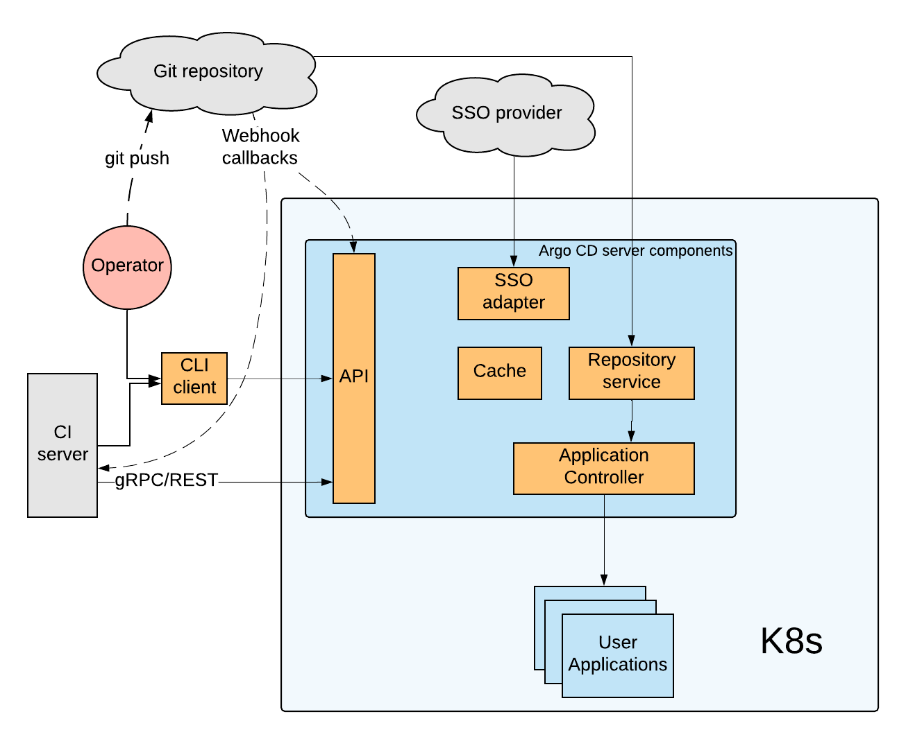

# Argo CD workshop

# Table of content

1. [Overview](#overview)
2. [Installation](./docs/01-installation)
3. [Basic usage](./docs/02-basic-usage)
4. [Organization workflow integration](./docs/04-organization-workflow)
5. [Application auto syncing](./docs/05-automated-sync)

# Overview

Argo CD is a new, lighweight Kubernetes-native continuous delivery (CD) system. "Kubernetes-native" means:

1. **Ideology** - Argo CD implements **GitOps** paradigm for CD. The main point - Git is our single source of true. After we push our app's config changes into the app config repo - argocd syncs the app state with the changes. I.e. our changes are **declarative.**
2. **Implementation** - Argo CD is built solely from the Kubernetes entities - custom resource definitions (CRD), a controller to process the CRDs, RBAC policies to organize security etc.

## Version

Current Argo CD version is 0.12.3
Version 1.0.0-rc3 is [available](https://github.com/argoproj/argo-cd/releases/tag/v1.0.0-rc3)
The Argo CD's roadmanp is [here](https://github.com/argoproj/argo-cd/milestones)

## Argo CD architecture

### Argo CD's Components

1. **API server**
* application management and status reporting
* invoking of application operations (e.g. sync, rollback, user-defined actions)
* credential management
* auth/authz management
* listener/forwarder for Git webhook events

2. **Application Controller**
* adjusts the application's actual state with the desired target one

3. **Repository Server**
* maintains a local cache of the Git repository

4. **Argo CD Client**
* a CLI application to interact with the argocd server

5. **SSO adapter**
* implements integrations with external SSO providers (Github, Google Cloud, LDAP etc.)

6. **Cache**
* a Redis instance that caches frequently accessed objects

## Features

* Supports both the pull and the push-based GitOps models to sync target environments with desired application state.
* Multiple manifests template formats: Helm, Kustomize, Ksonnet/Jsonnet or plain YAML manifests.
* Git branch tracking or tag/commit pinning.
* App synchronization: manual or automated.
* Rollback to any application state committed in the git repository.
* Continuous monitoring of deployed applications.
* Web console with visualized app's deployment scheme, logs and health statuses.

* Argo CD is agnostic to your CI system, and provides gRPC/REST/CLI to integrate with your CI of choice.
* SSO Integration (OIDC, LDAP, GitHub).
* Webhook integration (GitHub, GitLab, BitBucket).
* Complex application rollouts (e.g., canary upgrades, blue/green) via PreSync/Sync/PostSync hooks
