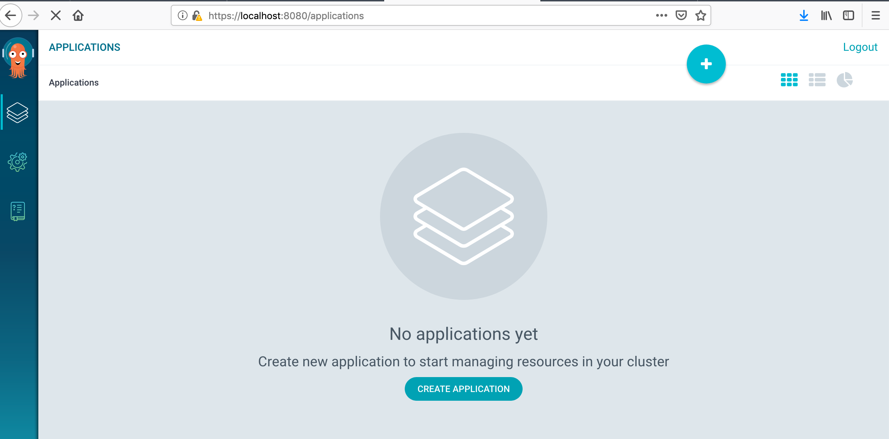

# ArgoCD Installation

## 1. Install Argo CD client

### macOS

```bash
brew tap argoproj/tap
brew install argoproj/tap/argocd
```

### Linux

```bash
ARGO_CD_LATEST=$(curl --silent "https://api.github.com/repos/argoproj/argo-cd/releases/latest" | grep '"tag_name"' | sed -E 's/.*"([^"]+)".*/\1/')
curl -sSL -o /usr/local/bin/argocd https://github.com/argoproj/argo-cd/releases/download/${ARGO_CD_LATEST}/argocd-linux-amd64
chmod +x /usr/local/bin/argocd
```

## 2. Install Argo CD server components

Create Argo CD's namespace in Kubernetes
```bash
kubectl create namespace argocd
```

Install the stable Argo CD's version
```
kubectl apply -n argocd -f https://raw.githubusercontent.com/argoproj/argo-cd/stable/manifests/install.yaml
```

<details>
<summary>Output</summary>

```
customresourcedefinition.apiextensions.k8s.io/applications.argoproj.io unchanged
customresourcedefinition.apiextensions.k8s.io/appprojects.argoproj.io unchanged
serviceaccount/argocd-application-controller created
serviceaccount/argocd-dex-server created
serviceaccount/argocd-server created
role.rbac.authorization.k8s.io/argocd-application-controller created
role.rbac.authorization.k8s.io/argocd-dex-server created
role.rbac.authorization.k8s.io/argocd-server created
clusterrole.rbac.authorization.k8s.io/argocd-application-controller unchanged
clusterrole.rbac.authorization.k8s.io/argocd-server unchanged
rolebinding.rbac.authorization.k8s.io/argocd-application-controller created
rolebinding.rbac.authorization.k8s.io/argocd-dex-server created
rolebinding.rbac.authorization.k8s.io/argocd-server created
clusterrolebinding.rbac.authorization.k8s.io/argocd-application-controller unchanged
clusterrolebinding.rbac.authorization.k8s.io/argocd-server unchanged
configmap/argocd-cm created
configmap/argocd-rbac-cm created
secret/argocd-secret created
service/argocd-dex-server created
service/argocd-metrics created
service/argocd-redis created
service/argocd-repo-server created
service/argocd-server-metrics created
service/argocd-server created
deployment.apps/argocd-application-controller created
deployment.apps/argocd-dex-server created
deployment.apps/argocd-redis created
deployment.apps/argocd-repo-server created
deployment.apps/argocd-server created
```
</details>


## 3. Change the default admin password

Expose the argocd's port - in another terminal panel input:

```bash
kubectl port-forward -n argocd service/argocd-server 8080:443
```

<details>
<summary>Output</summary>

```
Forwarding from 127.0.0.1:8080 -> 8080
Forwarding from [::1]:8080 -> 8080
Handling connection for 8080
```
</details>

Change the pass
```bash
argocd_default_pass=$(kubectl get pods -n argocd -l app.kubernetes.io/name=argocd-server -o name | cut -d'/' -f 2)
argocd_new_pass=newpass
argocd login --username=admin --password="${argocd_default_pass}" localhost:8080
argocd account update-password --current-password="${argocd_default_pass}" --new-password="${argocd_new_pass}"
argocd relogin --password="${argocd_new_pass}"
```

After installation we're able to use as the CLI client so the web UI

CLI
```
$ argocd app list
NAME  CLUSTER  NAMESPACE  PROJECT  STATUS  HEALTH  SYNCPOLICY  CONDITIONS
```

Web UI



[Back](./../../README.md)
