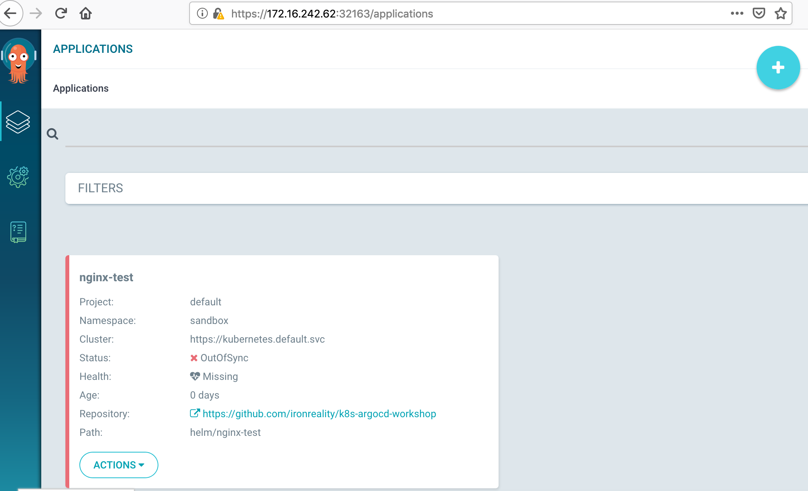
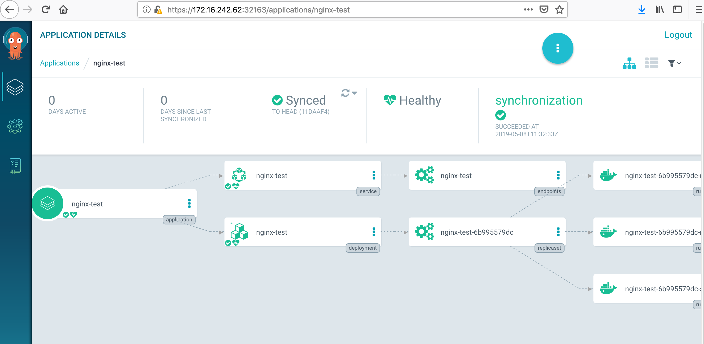
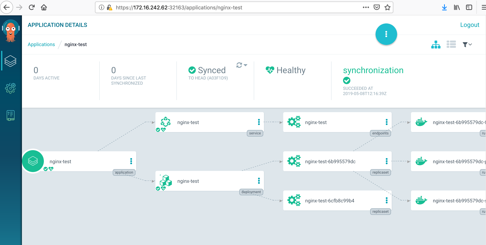
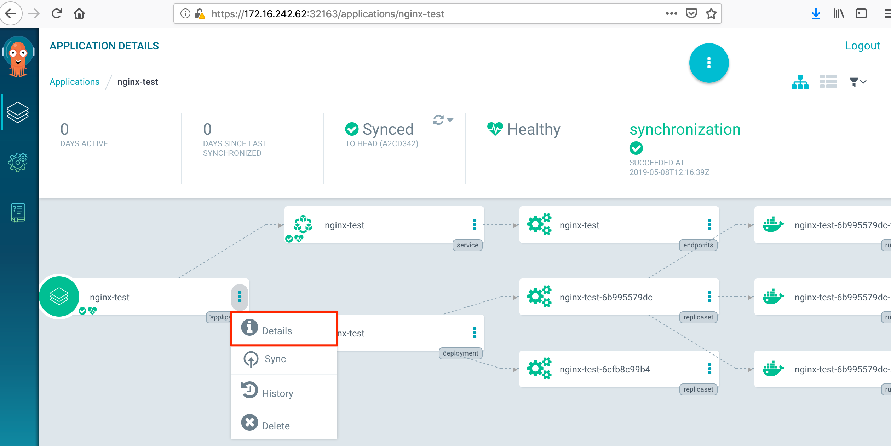
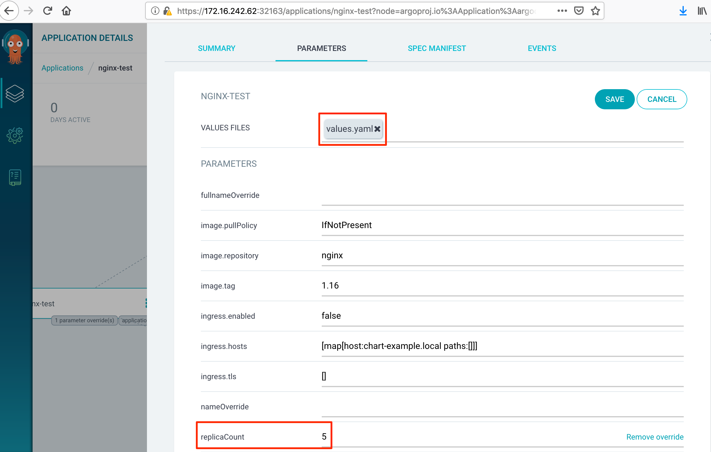
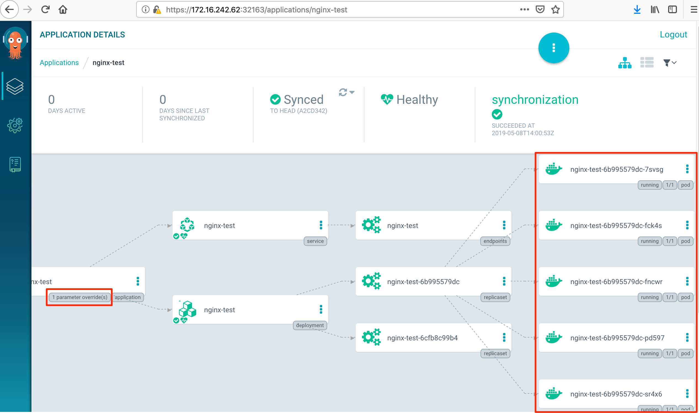
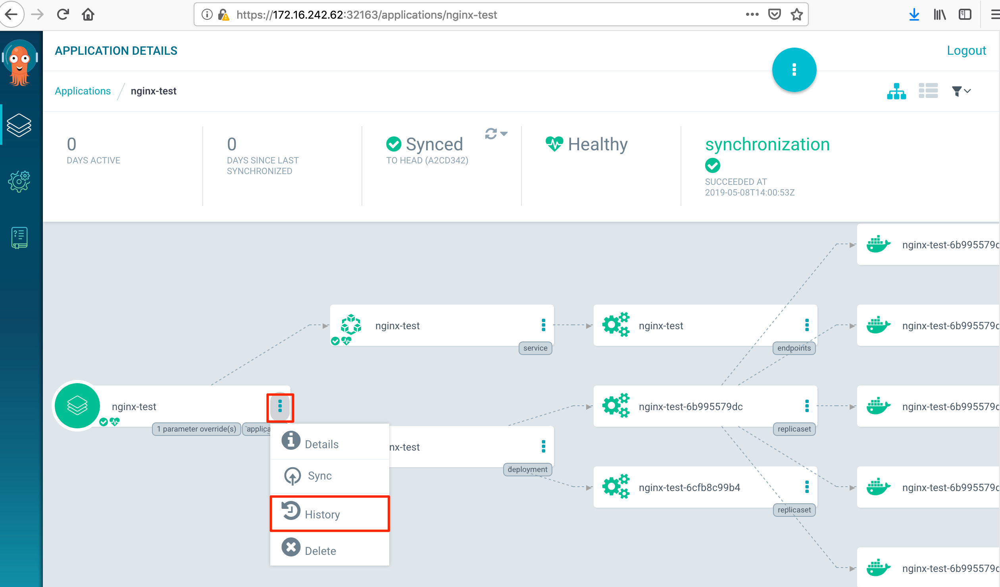
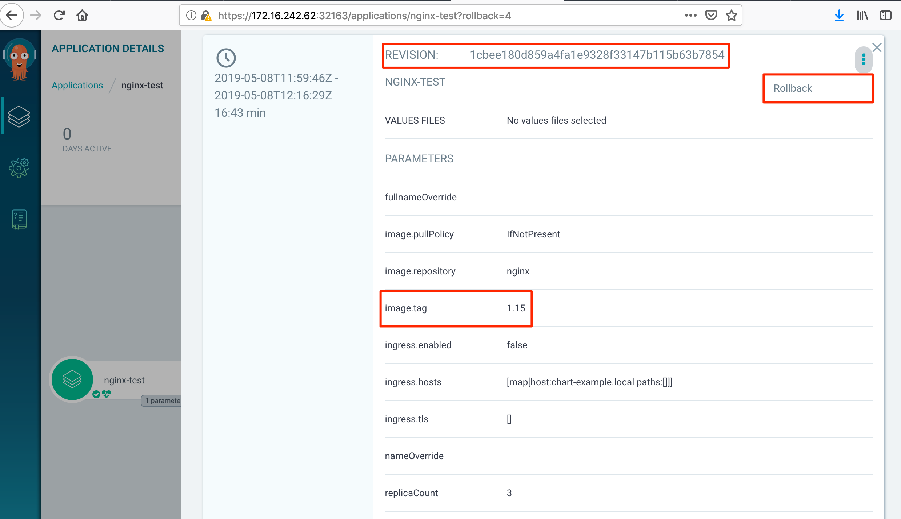
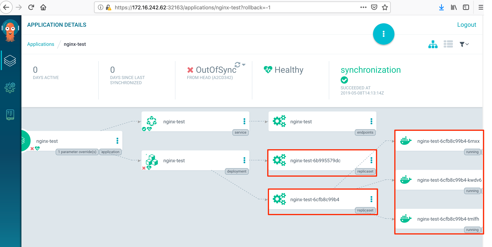

# Argo CD basic usage

# Example. A simple Helm-templated application deployment.

As a simple application we'll use Helm-charted Nginx installation. The chart is located in [helm/nginx-test](./../../helm/nginx-test) subdirectory of the workshop's repo.

1. [Preparation](#preparation)
1. [Creating the application](#creating-the-application)
1. [Syncing the application](#syncing-the-application)
1. [Changing the application parameters](#changing-the-application-parameters)
1. [Changing the application parameters from the web UI](#changing-the-application-parameters-from-the-web-ui)
1. [Rolling back the application to a previous version](#rolling-back-the-application-to-a-previous-version)
1. [Cleaning](#cleaning)

## Preparation

Connect to the argocd's API via k8s port forwarding and login into Argo CD in CLI:

```bash
# in a separate terminal window
kubectl port-forward -n argocd service/argocd-server 8080:443

argocd_admin_password="the_password_set_while_installation"
argocd login --username=admin --password="${argocd_admin_password}" localhost:8080
```

Create a k8s namespace to experiment within:

```bash
kubectl create namespace sandbox
```

## Creating the application

```bash
argocd app create nginx-test --repo https://github.com/ironreality/k8s-argocd-workshop --path helm/nginx-test --dest-server https://kubernetes.default.svc --dest-namespace sandbox
```

The result in the web UI:



## Syncing the application

"Sync" in Argo CD's [terms](https://argoproj.github.io/argo-cd/core_concepts/) is the process of adjusting the application's live state toward the target state defined in the application's source repository. 

<br>
Sync the app and wait till the sync will be finished

```
argocd app sync nginx-test && argocd app wait nginx-test
```

<details>
<summary>Output</summary>

```
Name:               nginx-test
Project:            default
Server:             https://kubernetes.default.svc
Namespace:          sandbox
URL:                https://localhost:8080/applications/nginx-test
Repo:               https://github.com/ironreality/k8s-argocd-workshop
Target:
Path:               helm/nginx-test
Sync Policy:        <none>
Sync Status:        OutOfSync from  (11daaf4)
Health Status:      Missing

Operation:          Sync
Sync Revision:      11daaf4e64d4fb65e93748ce2de7563a446aff53
Phase:              Succeeded
Start:              2019-05-08 14:32:32 +0300 EEST
Finished:           2019-05-08 14:32:33 +0300 EEST
Duration:           1s
Message:            successfully synced

GROUP  KIND        NAMESPACE  NAME        STATUS     HEALTH   HOOK  MESSAGE
       Service     sandbox    nginx-test  OutOfSync  Missing        service/nginx-test created
       apps   Deployment  sandbox    nginx-test  OutOfSync  Missing        deployment.apps/nginx-test created


TIMESTAMP                  GROUP        KIND   NAMESPACE                  NAME    STATUS   HEALTH            HOOK  MESSAGE
2019-05-08T14:32:22+03:00            Service     sandbox            nginx-test    Synced  Healthy                  service/nginx-test created
2019-05-08T14:32:22+03:00   apps  Deployment     sandbox            nginx-test    Synced  Progressing              deployment.apps/nginx-test
 created

 Name:               nginx-test
 Project:            default
 Server:             https://kubernetes.default.svc
 Namespace:          sandbox
 URL:                https://localhost:8080/applications/nginx-test
 Repo:               https://github.com/ironreality/k8s-argocd-workshop
 Target:
 Path:               helm/nginx-test
 Sync Policy:        <none>
 Sync Status:        Synced to  (11daaf4)
 Health Status:      Healthy

 Operation:          Sync
 Sync Revision:      11daaf4e64d4fb65e93748ce2de7563a446aff53
 Phase:              Succeeded
 Start:              2019-05-08 14:32:32 +0300 EEST
 Finished:           2019-05-08 14:32:33 +0300 EEST
 Duration:           1s
 Message:            successfully synced

 GROUP  KIND        NAMESPACE  NAME        STATUS  HEALTH   HOOK  MESSAGE
        Service     sandbox    nginx-test  Synced  Healthy        service/nginx-test created
        apps   Deployment  sandbox    nginx-test  Synced  Healthy        deployment.apps/nginx-test created
```
</details>

<br>
Now in the web ui we can see a graph of our app's Kubernetes objects




## Changing the application parameters

### Changing the Nginx version

```
git clone git@github.com:ironreality/k8s-argocd-workshop.git
cd k8s-argocd-workshop/helm/nginx-test

# I use yq tool to edit YAML but you could edit with any tool you like
yq write --verbose --inplace values.yaml image.tag 1.15

git add values.yaml
git commit -m "example: down Nginx version"
git push origin master
```

**Tip**

To view diff between the target and live application states you could use "argocd app diff ..." command:

```bash
$ argocd app diff nginx-test
===== apps/Deployment sandbox/nginx-test ======
41c41
<       - image: nginx:1.16
---
>       - image: nginx:1.15
```

<br>
After syncing the app in the web ui we see that Argo CD leveraged nginx-test's k8s deployment functionality - it scaled to 0 the old replica set and created a new replica set with new Nginx version.


<br>
We can check the Nginx version right now in the deployment's manifest window


If we turn back the nginx's version Argo CD will scale up the old nginx-test deployment's replica set

```
yq write  --inplace values.yaml image.tag 1.16
git add values.yaml
git commit -m "example: up nginx version"
git push origin master
argocd app sync nginx-test && argocd app wait nginx-test
```




## Changing the application parameters from the web UI

Sometimes wi will need to change the application deployment parameters (image version, replica count etc.) in ad-hoc manner without our CI/CD pipeline triggering. You can do so right in the web ui in the application parameter settings. Choose "Details" on the k8s object you're going to correct -> "Parameters" -> "Edit".



<br>
For example increase the replica count from 3 to 5.



<br>
Then press "Save" and perform the application sync. After sync we see that the number of pods in the deployment were increased and the label "parameter overrides" on the edited object has appeared.




## Rolling back the application to a previous version

With Argo CD we can perform rollbacks of our application directrly from the web ui. Just choose "History" in the app's menu and then find and choose the version needed to restore.


<br>


<br>
After the rollback we see the previous version's replica set is scaled up again



## Cleaning

```
argocd app delete nginx-test
kubectl delete namespace sandbox
```
