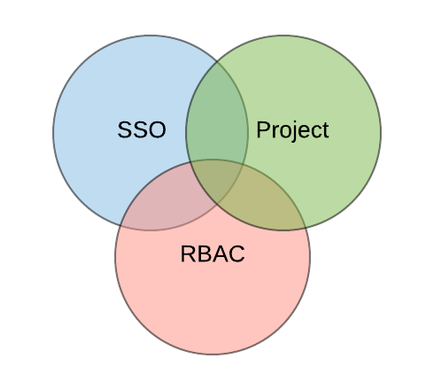
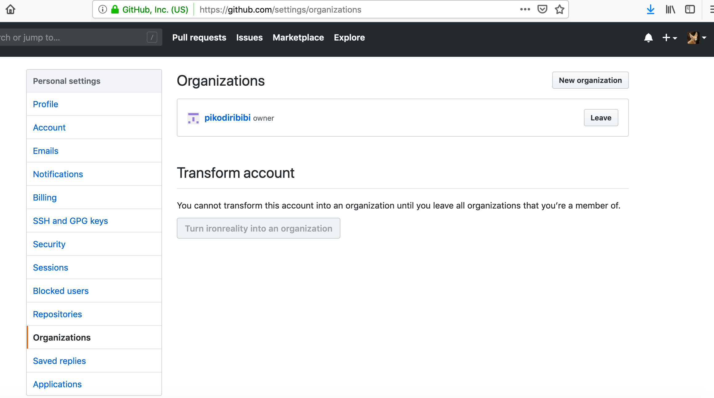
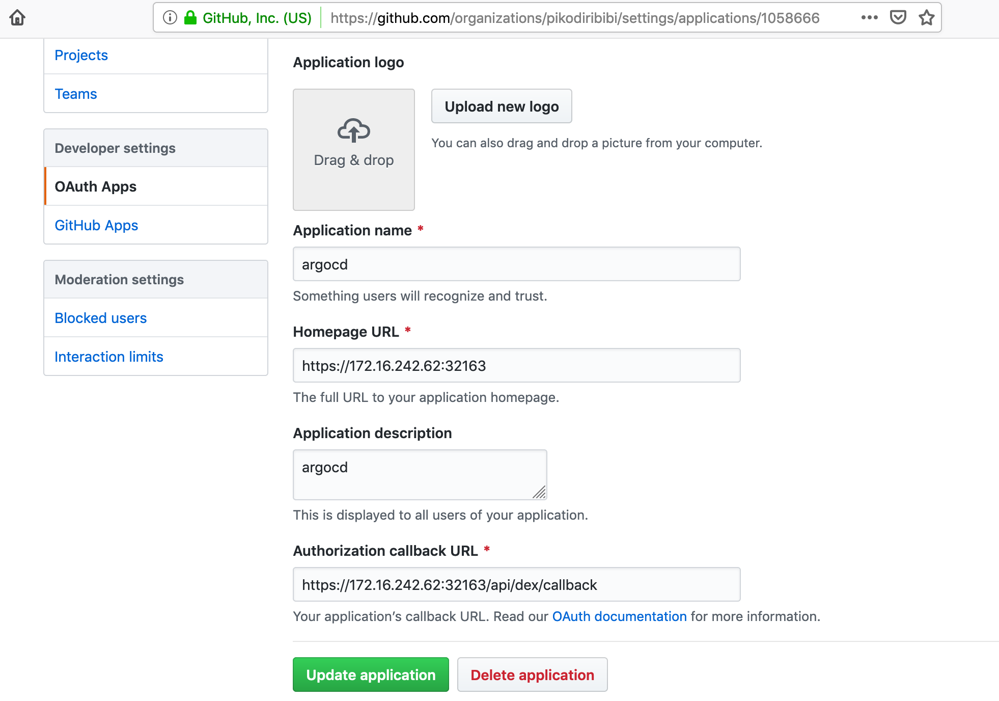
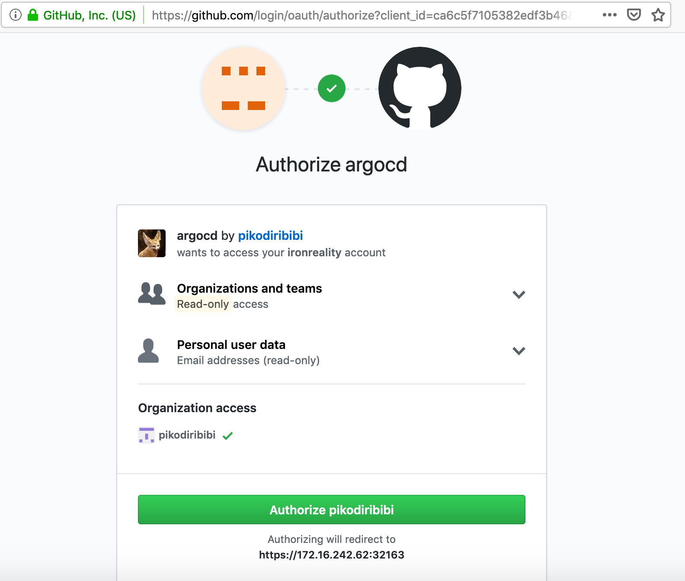
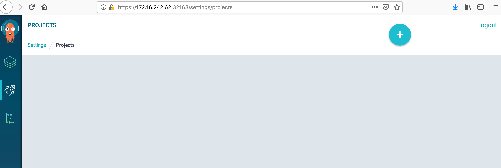
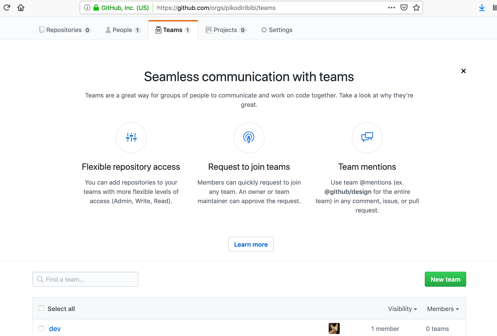
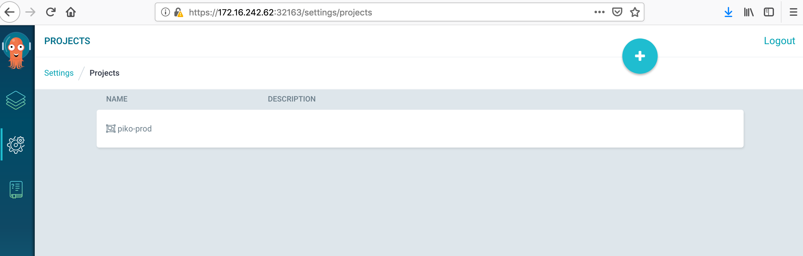
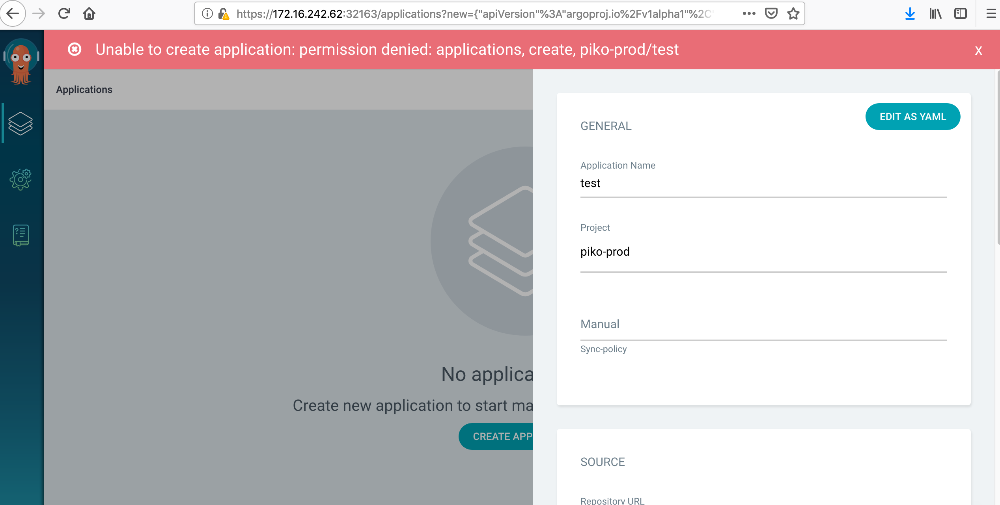
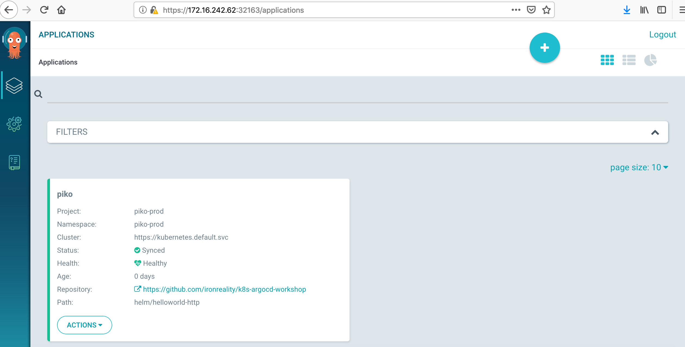

# Organization workflow integration

## ArgoCD security model

In order to map our current organization workflow to an Argo CD installation we should understand the Argo CD security model at first.
The model is built on the three main components:

* projects
* single sign-on system (SSO)
* role-based access control (RBAC)



**Project** is a custom Kubernetes object ([CRD](https://kubernetes.io/docs/concepts/extend-kubernetes/api-extension/custom-resources/)) to group logically related applications and repositories. 

**SSO** system is the source of authentication data (user and group names). Usually an organization would use some already working SSO solution (Github, Active Directory, etc).

**RBAC** is a common Kubernetes method to map project access grants to the user groups. Argo CD keeps its RBAC configuration in argocd-rbac-cm config map.


# Examples

* [Project manipulations](#project-manipulations)
* [SSO system integration - Github](#sso-system-integration)
* [RBAC creation](#rbac-creation)

## Preparation

Connect to the argocd's API via k8s port forwarding:

```
# in a separate terminal window
kubectl port-forward -n argocd service/argocd-server 8080:443
```

# Project manipulations

**Create a project** named "sandbox" bounded to "sandbox" namespace

```bash
argocd proj create sandbox -d https://kubernetes.default.svc,sandbox -s https://github.com/ironreality/k8s-argocd-workshop
kubectl create namespace sandbox
```

Try creating an app under "sanbox" project but in a wrong namespace:

```bash
argocd app create nginx-test --project sandbox --repo https://github.com/ironreality/k8s-argocd-workshop --path helm/nginx-test --dest-server https://kubernetes.default.svc --dest-namespace sandbox-1
```

Output
```text
FATA[0001] rpc error: code = InvalidArgument desc = application spec is invalid: InvalidSpecError: application destination {https://kubernetes.default.svc sandbox-1} is not permitted in project 'sandbox'
```

Try creating the app in the created project but with an unallowed source path:

```bash
argocd app create nginx-test --project sandbox --repo https://github.com/helm/charts --path stable/nginx-ingress --dest-server https://kubernetes.default.svc --dest-namespace sandbox
```

Output
```text
FATA[0003] rpc error: code = InvalidArgument desc = application spec is invalid: InvalidSpecError: application source {https://github.com/helm/charts stable/nginx-ingress  [] nil nil nil nil nil} is not permitted in project 'sandbox'
```

Create the app with the right source/destination and check the result
```bash
argocd app create nginx-test --project sandbox --repo https://github.com/ironreality/k8s-argocd-workshop --path helm/nginx-test --dest-server https://kubernetes.default.svc --dest-namespace sandbox

argocd app list
```

Output
```text
NAME        CLUSTER                         NAMESPACE  PROJECT  STATUS     HEALTH   SYNCPOLICY  CONDITIONS
nginx-test  https://kubernetes.default.svc  sandbox    sandbox  OutOfSync  Missing  <none>      <none>
```

## Create a project with a wildcarded source/destination names

```bash
argocd proj create sandbox-common -d https://kubernetes.default.svc,sandbox* -s https://github.com/ironreality/*
```

Create an app in the "wildcarded" project and check the applications
```bash
kubectl create namespace sandbox-1

argocd app create nginx-test-1 --project sandbox-common --repo https://github.com/ironreality/k8s-argocd-workshop --path helm/nginx-test --dest-server https://kubernetes.default.svc --dest-namespace sandbox-1

argocd app list
```

Output
```text
NAME          CLUSTER                         NAMESPACE  PROJECT         STATUS     HEALTH   SYNCPOLICY  CONDITIONS
nginx-test    https://kubernetes.default.svc  sandbox    sandbox         OutOfSync  Missing  <none>      <none>
nginx-test-1  https://kubernetes.default.svc  sandbox-1  sandbox-common  OutOfSync  Missing  <none>      <none>
```

Sync the apps
```
argocd app sync nginx-test
argocd app sync nginx-test-1
```

<details>
<summary>Output</summary>

```text
...

Name:               nginx-test-1
Project:            sandbox-common
Server:             https://kubernetes.default.svc
Namespace:          sandbox-1
URL:                https://localhost:8080/applications/nginx-test-1
Repo:               https://github.com/ironreality/k8s-argocd-workshop
Target:
Path:               helm/nginx-test
Sync Policy:        <none>
Sync Status:        Synced to  (5edc931)
Health Status:      Progressing

Operation:          Sync
Sync Revision:      5edc9319b941558add3e7bb88008e3ed9a54804a
Phase:              Succeeded
Start:              2019-05-03 14:36:11 +0300 EEST
Finished:           2019-05-03 14:36:11 +0300 EEST
Duration:           0s
Message:            successfully synced

GROUP  KIND        NAMESPACE  NAME          STATUS  HEALTH       HOOK  MESSAGE
       Service     sandbox-1  nginx-test-1  Synced  Healthy            service/nginx-test-1 created
apps   Deployment  sandbox-1  nginx-test-1  Synced  Progressing        deployment.apps/nginx-test-1 created
```
</details>


Now you should see in the web ui


## Cleaning

```bash
argocd app delete nginx-test
argocd app delete nginx-test-1

argocd proj delete sandbox
argocd proj delete sandbox-common

kubectl delete namespace sandbox-1
kubectl delete namespace sandbox
```

# SSO system integration

Official [documentation](https://argoproj.github.io/argo-cd/operator-manual/sso/)

As the SSO system we will use Github. Argo CD uses bundled [Dex](https://github.com/dexidp/dex) as the OIDC/Oauth2 provider. To register Dex, as well as any Oauth2 application, we have to create a Github organization first. In our Github account. I've created one called "pikodiribibi"



<br>
Then choose the organization, go to "Settings"->"Oauth Apps"->"New Oauth App" and input your app's name, Argo CD's homepage URL, and Argo CD Dex'es Oauth2 callback URL. As in Oauth2 the URLs don't have to be externally accessible in my case the parameters look so:



<br>
In the top part of the Oauth app's page we see Client ID and Client Secret parameters - we'll use them in the Dex configuration


<br>
Edit the Dex's config map to reflect the github oauth2 settings:

```bash
kubectl edit configmap argocd-cm -n argocd
```

and past the similar data section there:
```yaml
data:
  dex.config: |
    connectors:
      # GitHub example
      - type: github
        id: github
        name: GitHub
        config:
          clientID: ca6c5f7xxxxxxxxxxb46
          clientSecret: 27a675b2ccf6xxxxxxxxxxd5371b1d8369ff38ca
          orgs:
          - name: pikodiribibi
  url: https://172.16.242.62:32163
```
<br>
Next time we login into the Argo CD the login page will contain the Github login button


<br>
After we click the button the Oauth2 access grant dialog appears



<br>
Press "Authorize <your_github_app_name>" and you got it - the SSO configuration is completed! 


# RBAC creation

Official [documentation](https://argoproj.github.io/argo-cd/operator-manual/rbac/)

Create a k8s namespace and an Argo CD project bounded to this namespace:

```bash
kubectl create namespace piko-prod
argocd proj create piko-prod -d https://kubernetes.default.svc,piko-prod -s '*'
```
<br>
If we login to the web ui via Github we see no projects available because RBAC denies access by default



<br>
Next create a team in your Github organization - choose "Teams"->"New team". By default your Github user will be a member of the created team.



<br>
Configure the needed RBAC roles and groups in section "data" of argocd-rbac-cm config map.
First, create a role with read-only access and apply it to the config map via "kubectl patch" command.

**The RBAC edition is a potentially dangerous operation so backup the RBAC policy config first**

To backup in such way you should have jq installed
```bash
kubectl get cm argocd-rbac-cm -n argocd -o=json | jq '.data | to_entries[] | { "data": { "policy.csv": .value } }' > rbac_backup.json
```

Now create and apply the RBAC config
```bash
cat > piko-readonly.yaml<<EOF
data:
  policy.csv: |
    p, role:piko-readonly, applications, get, piko-prod/*, allow
    p, role:piko-readonly, projects, get, piko-prod, allow
    p, role:piko-readonly, clusters, get, *, allow
    p, role:piko-readonly, repositories, get, *, allow

    g, pikodiribibi:dev, role:piko-readonly
EOF

kubectl patch cm argocd-rbac-cm -n argocd --patch "$( cat piko-readonly.yaml)"

kubectl get cm argocd-rbac-cm -n argocd --output=yaml
```

<details>
<summary>Output</summary>

```yaml
apiVersion: v1
data:
  policy.csv: |-
    p, role:piko-readonly, applications, get, piko-prod/*, allow
    p, role:piko-readonly, projects, get, piko-prod, allow
    p, role:piko-readonly, clusters, get, *, allow
    p, role:piko-readonly, repositories, get, *, allow

    g, pikodiribibi:dev, role:piko-readonly
kind: ConfigMap
...
```
</details>

<br>
After re-login to the web UI we can see piko-prod project accessible


<br>
But we can't create an application yet



Let's create and apply a RBAC role with read-write project access
```bash
cat >piko-admin.yaml<<EOF
data:
  policy.csv: |
    p, role:piko-admin, applications, *, piko-prod/*, allow
    p, role:piko-admin, projects, get, piko-prod, allow
    p, role:piko-admin, clusters, get, *, allow
    p, role:piko-admin, repositories, *, *, allow

    g, pikodiribibi:dev, role:piko-admin
EOF

kubectl patch cm argocd-rbac-cm -n argocd --patch "$( cat piko-admin.yaml)"


kubectl get cm argocd-rbac-cm -n argocd --output=yaml
```

<details>
<summary>Output</summary>

```yaml
apiVersion: v1
data:
  policy.csv: |-
    p, role:piko-admin, applications, *, piko-prod/*, allow
    p, role:piko-admin, projects, get, piko-prod, allow
    p, role:piko-admin, clusters, get, *, allow
    p, role:piko-admin, repositories, *, *, allow

    g, pikodiribibi:dev, role:piko-admin
kind: ConfigMap
```
</details>

**Note that kubectl patch has completely rewritten the data section in the config map!**

<br>
Now we're able to create an application in piko-prod project


## Cleaning

```bash
argocd app delete piko
argocd proj delete piko-prod
kubectl delete namespace piko-prod
# to restore the previously backuped RBAC config:
# kubectl patch cm argocd-rbac-cm -n argocd --patch "$(cat rbac_backup.json)"
```

[Main page](./../../README.md)
