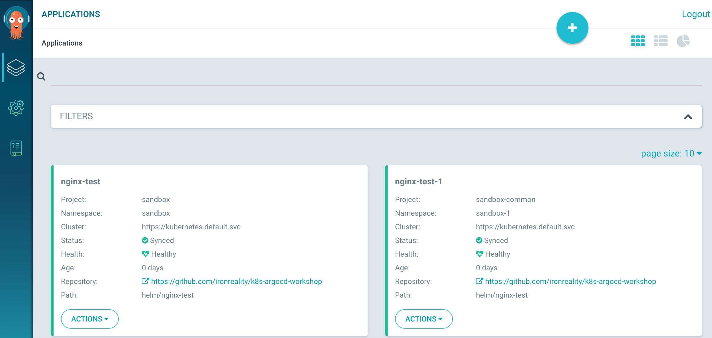

# Organization workflow integration

Applications are being organized via [projects](https://argoproj.github.io/argo-cd/user-guide/projects/)

## Create a project

```bash
argocd proj create sandbox -d https://kubernetes.default.svc,sandbox -s https://github.com/ironreality/k8s-argocd-workshop
kubectl create namespace sandbox
```

Try creating an app under the created project but into a wrong namespace:

```bash
argocd app create nginx-test --project sandbox --repo https://github.com/ironreality/k8s-argocd-workshop --path helm/nginx-test --dest-server https://kubernetes.default.svc --dest-namespace sandbox-1
```

Output
```text
FATA[0001] rpc error: code = InvalidArgument desc = application spec is invalid: InvalidSpecError: application destination {https://kubernetes.default.svc sandbox-1} is not permitted in project 'sandbox'
```

Try creating the app in the created project but from a wrong source path:

```bash
argocd app create nginx-test --project sandbox --repo https://github.com/helm/charts --path stable/nginx-ingress --dest-server https://kubernetes.default.svc --dest-namespace sandbox
```

Output
```text
FATA[0003] rpc error: code = InvalidArgument desc = application spec is invalid: InvalidSpecError: application source {https://github.com/helm/charts stable/nginx-ingress  [] nil nil nil nil nil} is not permitted in project 'sandbox'
```

Create the app with the right source/destination and check the result
```bash
argocd app create nginx-test --project sandbox --repo https://github.com/ironreality/k8s-argocd-workshop --path helm/nginx-test --dest-server https://kubernetes.default.svc --dest-namespace sandbox

argocd app list
```

Output
```text
NAME        CLUSTER                         NAMESPACE  PROJECT  STATUS     HEALTH   SYNCPOLICY  CONDITIONS
nginx-test  https://kubernetes.default.svc  sandbox    sandbox  OutOfSync  Missing  <none>      <none>
```

## Create a project with a wildcarded source/destination names

```bash
argocd proj create sandbox-common -d https://kubernetes.default.svc,sandbox* -s https://github.com/ironreality/*
```

Create an app in the "wildcarded" project and check the applications
```bash
kubectl create namespace sandbox-1

argocd app create nginx-test-1 --project sandbox-common --repo https://github.com/ironreality/k8s-argocd-workshop --path helm/nginx-test --dest-server https://kubernetes.default.svc --dest-namespace sandbox-1

argocd app list
```

Output
```text
NAME          CLUSTER                         NAMESPACE  PROJECT         STATUS     HEALTH   SYNCPOLICY  CONDITIONS
nginx-test    https://kubernetes.default.svc  sandbox    sandbox         OutOfSync  Missing  <none>      <none>
nginx-test-1  https://kubernetes.default.svc  sandbox-1  sandbox-common  OutOfSync  Missing  <none>      <none>
```

Sync the apps
```
argocd app sync nginx-test
argocd app sync nginx-test-1
```

<details>
<summary>Output</summary>

```text
...

Name:               nginx-test-1
Project:            sandbox-common
Server:             https://kubernetes.default.svc
Namespace:          sandbox-1
URL:                https://localhost:8080/applications/nginx-test-1
Repo:               https://github.com/ironreality/k8s-argocd-workshop
Target:
Path:               helm/nginx-test
Sync Policy:        <none>
Sync Status:        Synced to  (5edc931)
Health Status:      Progressing

Operation:          Sync
Sync Revision:      5edc9319b941558add3e7bb88008e3ed9a54804a
Phase:              Succeeded
Start:              2019-05-03 14:36:11 +0300 EEST
Finished:           2019-05-03 14:36:11 +0300 EEST
Duration:           0s
Message:            successfully synced

GROUP  KIND        NAMESPACE  NAME          STATUS  HEALTH       HOOK  MESSAGE
       Service     sandbox-1  nginx-test-1  Synced  Healthy            service/nginx-test-1 created
apps   Deployment  sandbox-1  nginx-test-1  Synced  Progressing        deployment.apps/nginx-test-1 created
```
</details>


Now you should see in the web ui




## Cleaning

```bash
argocd app delete nginx-test
argocd app delete nginx-test-1
argocd proj delete sandbox
kubectl delete namespace sandbox-1
kubectl delete namespace sandbox
```

[Main page](./../../README.md)
