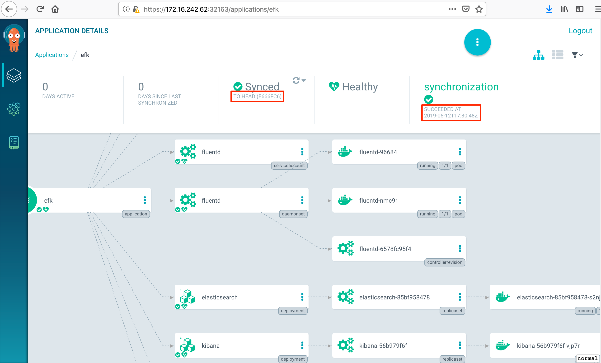
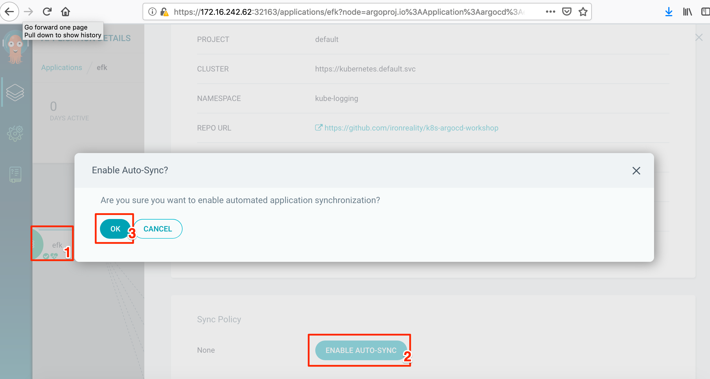
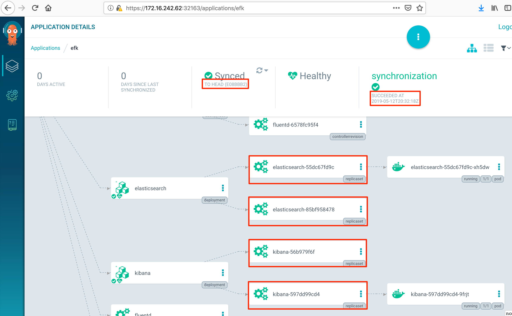

# Automated sync of Argo CD's applications

Currently Argo CD has two modes for application's state syncing:

* auto-polling of the app repository
* webhook-triggered sync

In this lab we'll explore both these methods.

# Examples

* [Creating a testing plain manifest-based application](#creating-a-testing-plain-manifest-based-application)
* [Syncing the app state via repo polling](#syncing-the-app-state-via-repo-polling)
* [Syncing the app state via webhook callbacks](#syncing-the-app-state-via-webhook-callbacks)
* [Cleaning](#cleaning)

## Preparation

Connect to the argocd's API via K8s port forwarding:

```
# in a separate terminal window
kubectl port-forward -n argocd service/argocd-server 8080:443
```


## Creating a testing plain manifest-based application

Our test application is EFK stack (Elasticsearch+Fluentd+Kibana) providing log aggregation for Kubernetes logging facilities. The stack is being deployed through plain text Kubernetes manifests placed in [manifests/efk](../../manifests/efk) directory.

First, create kube-logging namespace for the deployment

```
kubectl create namespace kube-logging
```

Then create the app

```
argocd app create efk --repo https://github.com/ironreality/k8s-argocd-workshop --path "manifests/efk" --dest-namespace kube-logging --dest-server https://kubernetes.default.svc

argocd app sync efk && argocd app sync efk
```

<details>
<summary>Output</summary>

```text
Name:               efk
Project:            default
Server:             https://kubernetes.default.svc
Namespace:          kube-logging
URL:                https://localhost:8080/applications/efk
Repo:               https://github.com/ironreality/k8s-argocd-workshop
Target:
Path:               manifests/efk
Sync Policy:        <none>
Sync Status:        Synced to  (c4e4330)
Health Status:      Healthy

Operation:          Sync
Sync Revision:      c4e43307e836b92fa32c7ab2de0dbaa2d413ccc7
Phase:              Succeeded
Start:              2019-05-14 13:41:46 +0300 EEST
Finished:           2019-05-14 13:41:49 +0300 EEST
Duration:           3s
Message:            successfully synced

GROUP                      KIND                NAMESPACE     NAME           STATUS  HEALTH   HOOK  MESSAGE
rbac.authorization.k8s.io  ClusterRole                       fluentd        Synced  Healthy
apps                       DaemonSet           kube-logging  fluentd        Synced  Healthy        daemonset.apps/fluentd created
extensions                 Deployment          kube-logging  elasticsearch  Synced  Healthy        deployment.extensions/elasticsearch created
extensions                 Deployment          kube-logging  kibana         Synced  Healthy        deployment.extensions/kibana created
                           Service             kube-logging  kibana         Synced  Healthy        service/kibana created
rbac.authorization.k8s.io  ClusterRoleBinding                fluentd        Synced  Healthy
                           Namespace                         kube-logging   Synced  Healthy
                           Service             kube-logging  elasticsearch  Synced  Healthy        service/elasticsearch created
                           ServiceAccount      kube-logging  fluentd        Synced  Healthy        serviceaccount/fluentd created
```

</details>

The web UI after app syncing.  **Note the last sync time and repo commit**




## Syncing the app state via repo polling

Now choose efk application in the web ui, click on "Enable auto-syncing" and then on "OK"


Change the code in an app's manifest and commit it into the remote repo. For instance, change the Elasticsearch and Kibana's image versions from "6.7.2" to "7.0.1"

```bash
vim -o manifests/efk/01_elasticsearch.yaml manifests/efk/02_kibana.yaml 
git add manifests/efk/01_elasticsearch.yaml manifests/efk/02_kibana.yaml
git commit -m "example: up es and kibana to 7.0.1"
git push origin master
```

The default Argo CD's polling interval is 3 min. In a few minutes the last commited changes will be deployed




## Syncing the app state via webhook callbacks

Official [doc](https://argoproj.github.io/argo-cd/operator-manual/webhook/)

The API server can be configured to receive webhook events. Argo CD supports Git webhook notifications from GitHub, GitLab, and BitBucket.

**In order to recieve webhook notifications from the providers the callback URL must be accessible from outside.**

## Cleaning

```
argocd app delete efk
```

[Main page](./../../README.md)
